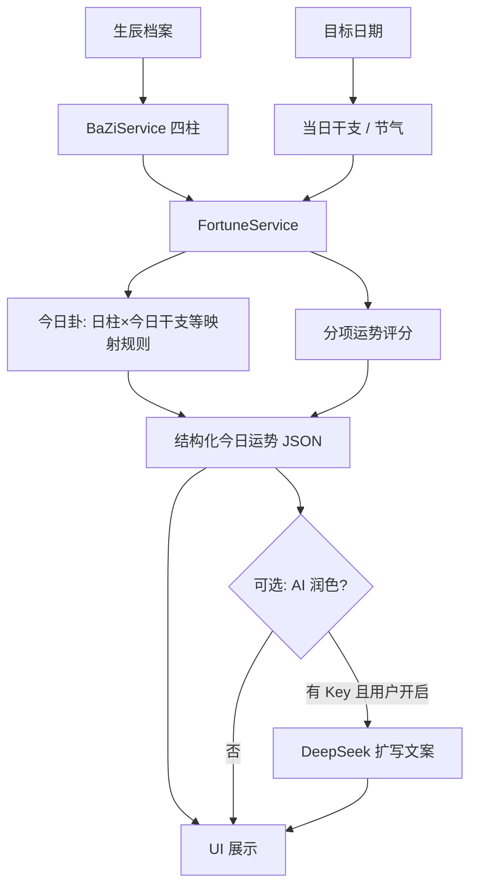
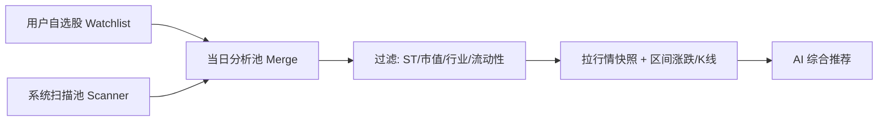
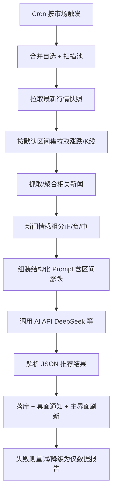

# 百宝箱（Treasure Chest）技术方案

> 版本：v0.13  
> 日期：2026-07-30  
> 状态：草案（核心范围已确认）

---

## 1. 产品目标

做一个可在 **macOS（Intel x64 + Apple Silicon arm64）** 与 **Windows（x64）** 上运行的桌面「百宝箱」应用，首期提供两个工具，并具备完整的桌面设置能力（**开机自启、系统托盘、多语言** 等）：

| 模块 | 核心诉求 |
|------|----------|
| **万年历** | 信息丰富、视觉华丽；独立窗口（挂件/大屏）；翻页特效；支持录入 **出生日期或生辰八字**，每日生成 **卦象分析、运势分析** 等 |
| **股票推荐** | 覆盖 **A 股 + 美股**；工作日自动分析；可配置 AI API Key；**系统推荐 + 自选**；附带正/负面新闻；**拉取并展示指定时间范围的股价涨跌** |
| **系统设置** | **开机自启**、托盘常驻、通知、主题；**多语言（i18n）** 首期至少中/英，架构可扩展 |

### 1.1 已确认产品决策

| 决策项 | 结论 |
|--------|------|
| 技术框架 | **仅采用 Electron + React + TypeScript**（不考虑 Tauri）；**依赖一律最新稳定版**（见 §2.3） |
| 股票市场范围 | **A 股 + 美股** 均支持，设置中可开关单一市场或双开 |
| 候选股票池 | **双轨**：系统按规则/AI 扫描推荐 + 用户自选股（自选优先纳入当日分析） |
| 日历独立窗形态 | **小尺寸桌面挂件** 与 **大屏展示窗** 均支持，可一键切换并记住上次形态 |
| 今日卦象 / 运势 | 用户提供 **公历/农历出生日期（可含时辰）** 或直接录入 **生辰八字**；每日出卦象与运势分析（娱乐向，见免责） |
| 股价涨跌区间 | 支持按 **预设区间 + 自定义起止日期** 拉取 K 线/涨跌幅，用于展示、扫描预筛与 AI 输入 |
| 开机自启与托盘 | **支持**：设置可开关开机自启；系统托盘常驻，关闭主窗可最小化到托盘 |
| 多语言 | **保留并首期落地**：至少 `zh-CN` / `en-US`，文案与部分区域格式随语言切换 |
| 工程与目录规范 | **按功能模块划分目录**；遵循 Electron / TypeScript / React 业界常规；新功能以独立 feature 落地，禁止堆在杂目录 |
| 本地存储 | **用户配置与业务数据统一 SQLite**；API Key 走 OS 安全存储；全部本机不上云 |
| 配置迁移 | 设置页支持 **导出 / 导入**，换机可恢复配置与自选等用户数据 |
| 视觉主题 | **「霜灰 · 潮青」**；色值 **只集中在 `tokens.css` 一处**；页面只引用 CSS 变量；见 §3.4 |

后续可按插件式扩展更多小工具，故架构上预留「工具箱」扩展位（见 §7）。

---

## 2. 框架选型与结论

### 2.1 为何选定 Electron

本产品需要：跨 Intel Mac / Apple Silicon / Windows 的一致渲染、多独立窗口、华丽翻页特效、系统托盘与开机自启、定时任务与 AI/新闻抓取。综合交付效率与能力匹配度，**唯一选型为 Electron + React + TypeScript + Vite**。

| 能力 | Electron 是否满足 |
|------|-------------------|
| 跨平台 UI 一致性 | 是（自带 Chromium） |
| 多独立窗口 / 置顶挂件 | 是（`BrowserWindow` 成熟） |
| Canvas / WebGL / CSS 3D 特效 | 是 |
| 开机自启 / 系统托盘 / 桌面通知 | 是（`app.setLoginItemSettings`、Tray、Notification） |
| 定时调度 + Node 生态抓取 / AI SDK | 是 |
| 双架构 Mac + Windows 打包 | 是（electron-builder） |

其它桌面方案（含 Tauri）不在本项目考虑范围内。

### 2.2 技术栈一览

```
┌─────────────────────────────────────────────────────────┐
│  Electron (主进程)                                       │
│  · 窗口管理 / 系统托盘 / 开机自启 / 桌面通知               │
│  · node-cron 定时（A 股/美股可分别配置）                    │
│  · 安全存储 API Key（keytar / safeStorage）               │
│  · 自选股 + 扫描池 / 新闻抓取 Worker / 本地 SQLite         │
│  · 用户设置持久化（含语言、自启、主题、生辰档案等）         │
└──────────────────────┬──────────────────────────────────┘
                       │ IPC
┌──────────────────────▼──────────────────────────────────┐
│  渲染进程：React + TypeScript + Vite（均为开工时最新稳定版） │
│  · 主壳：工具导航 / 设置（i18n）                          │
│  · 日历窗：独立 BrowserWindow（黄历 + 今日卦象/运势）      │
│  · 股票窗：推荐结果 / 新闻 / 历史 / 区间涨跌               │
│  UI：自研视觉 + 动效库（开工时选最新稳定版，如 Motion/GSAP）│
│  样式：CSS Variables + 适度动画（避免纯扁平单色）         │
│  i18n：i18next / react-i18next（最新稳定版）              │
└─────────────────────────────────────────────────────────┘
         │
         ├── DeepSeek / OpenAI 兼容 API（荐股；可选润色运势文案）
         ├── 行情数据源（见 §5）
         └── 新闻源 / RSS / 公开检索 API（见 §5）
```

配套工具建议（安装时取 **npm/registry 最新稳定版**，不锁过旧 major）：

- 打包：`electron-builder`（或官方推荐的等价方案）最新稳定版
- 状态：Zustand 或 Jotai（取其一最新稳定版）
- 本地库：`better-sqlite3`（或同等）最新稳定版；**用户配置 + 业务数据统一 SQLite**，密钥走 OS 安全存储（见 §6.1）
- 农历/节气/八字：`lunar-javascript`（或同等）封装 `CalendarService` + `BaZiService`
- 卦象/运势：本地规则引擎 `FortuneService`；可选 AI 扩写
- 国际化：`i18next` + `react-i18next` 最新稳定版
- 校验：`zod` 最新稳定版（IPC/配置 payload）
- 开机自启：Electron `app.setLoginItemSettings`
- 日志：`electron-log` 最新稳定版
- 测试：`vitest` 最新稳定版；类型检查用当前 TypeScript 稳定版

### 2.3 依赖版本策略（必须遵守）

| 规则 | 说明 |
|------|------|
| **最新稳定版** | 脚手架初始化及新增依赖时，安装 **latest stable**（npm `latest` 标签）；**禁止**故意使用已过时 major 凑合 |
| **禁止预发布当默认** | 不使用 `alpha` / `beta` / `rc` / `nightly` 作为默认依赖，除非某能力仅预发布提供且经书面确认 |
| **版本记录** | `package.json` 用兼容范围（如 `^`）锁定到当前稳定 major；`package-lock.json` / `pnpm-lock.yaml` 入库，保证可复现构建 |
| **升级节奏** | 日常开发跟进 patch/minor；Electron / React 等 major 在支持期内尽快跟进，避免停在即将 EOL 的版本 |
| **安装方式** | 优先 `pnpm create` / 官方模板或 `npm create @quick-start/electron` 等生成后，再 `update` 到各包最新稳定版并跑通 typecheck |
| **文档不写死旧号** | 本方案中的「React 18」等仅作历史表述；**以开工当日 registry 最新稳定版为准**（例如 Electron 取当前 stable 主线，React 取当前正式版） |
| **兼容性** | 若某最新稳定版与 Electron 打包存在已知阻断 bug，可临时钉在「上一稳定小版本」，并在 ADR/`docs` 记原因与解除条件 |

开工检查清单（M0）：

1. `node -v` 使用 Electron / 工具链要求的 **现行 LTS 或官方支持版本**  
2. `electron`、`react`、`react-dom`、`vite`、`typescript`、`electron-builder` 均为安装时 `npm view <pkg> version` 的稳定版  
3. CI 与本地同一 lockfile  

---

## 3. 应用信息架构

### 3.1 窗口模型

| 窗口 | 职责 | 说明 |
|------|------|------|
| 主窗口 | 工具入口、全局设置、股票报告浏览 | 可最小化到托盘；关闭行为可配置为「退出」或「隐藏到托盘」 |
| 日历独立窗口 | 「今日牌」万年历 + **今日卦象/运势摘要**；**挂件 / 大屏** | 可从主窗口弹出；支持始终置顶、鼠标穿透（可选）；形态可切换并持久化 |
| （可选）股票速览浮窗 | 当日推荐摘要 | 推送后短暂弹出 |
| 系统托盘 | 常驻入口 | 打开主窗、日历窗、今日荐股、退出；托盘图标可反映任务状态 |

### 3.2 导航结构（主窗口）

```
百宝箱
├── 首页（今日摘要：日期 digests + 运势速览 + 今日荐股状态）
├── 万年历
│   ├── 今日 / 月视图
│   ├── 今日卦象与运势
│   └── 生辰档案（出生日期 / 八字录入与校验）
├── 股票推荐
│   ├── 今日报告（A 股 / 美股分栏或标签）
│   ├── 自选股管理（含区间涨跌速览）
│   ├── 行情区间（选股/报告内切换 1D/1W/1M… 或自定义）
│   ├── 历史报告
│   └── 分析设置（模型、Key、市场开关、扫描池、风险偏好、默认涨跌区间）
└── 设置
    ├── 通用
    │   ├── 语言（多语言切换）
    │   ├── 开机自启
    │   ├── 关闭主窗时：退出 / 最小化到托盘
    │   ├── 系统托盘常驻
    │   ├── 桌面通知（荐股完成 / 任务失败 / 可选每日运势提醒）
    │   └── 主题（浅色 / 深色 / 跟随系统）
    ├── AI 提供商
    ├── 备份与迁移
    │   ├── 导出配置包
    │   └── 导入配置包
    └── 关于 / 检查更新
```

---

## 3.3 模块三：系统设置与多语言

首期将「设置」作为一等能力，与日历、荐股并列交付（可随 M0/M5 穿插落地，但需求上为必做）。

### 3.3.1 开机自启与其它桌面设置

| 设置项 | 行为 | 实现要点 |
|--------|------|----------|
| **开机自启** | 用户可开/关；开启后登录系统自动启动应用 | `app.setLoginItemSettings({ openAtLogin })`；Mac/Win 分别验证；UI 展示当前系统实际状态 |
| **启动后行为** | 启动后显示主窗 / 仅托盘 / 同时打开日历挂件 | 写入 SQLite `app_settings` |
| **系统托盘** | 默认开启常驻；托盘菜单多语言 | `Tray` + 上下文菜单；勿在关闭托盘时导致无法找回窗口 |
| **关闭主窗** | 「最小化到托盘」或「退出应用」 | 默认建议「到托盘」，避免误杀定时任务 |
| **桌面通知** | 荐股完成、任务失败、重要节日提醒、**可选每日运势提醒** | 系统 Notification；可总开关与分项开关 |
| **主题** | 浅色 / 深色 / 跟随系统 | 色彩与字体 token 见 §3.4；日历窗同步 |
| **配置导出/导入** | 换机迁移用户配置与自选等 | 见 §3.3.3 |

定时荐股依赖进程存活，因此 **推荐默认：开机自启开、托盘常驻、关主窗进托盘**（用户仍可关闭自启）。

### 3.3.2 多语言（i18n）

| 项 | 约定 |
|----|------|
| 首期语言包 | **简体中文 `zh-CN`**、**英语 `en-US`**；架构预留增补（如 `zh-TW`、`ja`） |
| 覆盖范围 | 主界面、设置、托盘菜单、通知文案、空态/错误提示、免责声明；黄历「宜忌」、**卦名/运势模板** 按语言展示或中英对照 |
| 默认语言 | 跟随系统 locale；若无匹配则回退 `zh-CN`；用户手动选择后持久化，优先生效 |
| 切换时机 | 设置页即时切换，无需重启；主进程菜单/托盘同步 IPC 刷新 |
| 区域格式 | 日期、数字、涨跌幅符号随 locale（`Intl`）；股价颜色习惯可按市场（A 股红涨绿跌 / 美股可配置） |
| 工程约定 | 禁止硬编码用户可见中文；key 命名如 `settings.launchAtLogin`；CI 可加缺失 key 检查（二期） |

技术建议：`i18next` + `react-i18next`，语言资源放 `src/locales/{lang}/*.json`；Electron 主进程共用同一套 JSON 或镜像一份 `electron/locales`。

### 3.3.3 配置导出与导入（换机迁移）

设置页提供 **备份与迁移**，支持用户换电脑后恢复配置与相关用户数据。

| 能力 | 行为 |
|------|------|
| **导出** | 弹出另存为对话框，生成配置包文件（建议扩展名 `.tchest` 或 `.json`）；默认文件名含日期，如 `treasure-chest-backup-2026-07-30.tchest` |
| **导入** | 选择配置包 → 校验格式与版本 → 用户确认范围与冲突策略 → 写入本机 SQLite（及可选密钥）→ 提示重启或热刷新生效 |
| **入口** | 设置 → 备份与迁移；文案说明「用于换机恢复，请妥善保管备份文件」 |

#### 导出内容范围（可勾选）

| 类别 | 默认 | 说明 |
|------|------|------|
| 应用配置 `app_settings` | ✓ | 语言、主题、自启偏好、市场/调度、AI 非密钥项等 |
| 生辰档案 | ✓ | 生日 / 八字 |
| 自选股 | ✓ | watchlist |
| 窗口态 `window_state` | 可选 | 换机分辨率不同，默认可不勾选或导入时忽略 bounds |
| 荐股历史 / 运势日更缓存 | 可选 | 体积可能较大；默认可不导出 |
| 新闻 / K 线缓存 | ✗ | 默不导出，换机后可重新拉取 |
| **API Key** | 可选（默认关闭） | 见下方安全策略 |

#### 包格式（示意）

```json
{
  "magic": "treasure-chest-backup",
  "formatVersion": 1,
  "appVersion": "0.1.0",
  "exportedAt": "2026-07-30T11:38:00+08:00",
  "platform": "darwin",
  "sections": {
    "app_settings": [{ "key": "ui.locale", "value": "zh-CN" }],
    "bazi_profiles": [/* … */],
    "watchlist": [/* … */],
    "window_state": [/* … */]
  },
  "secrets": {
    "included": false,
    "items": []
  },
  "checksum": "sha256:…"
}
```

实现要点：

- 主进程 `BackupService`：`exportBackup(options)` / `importBackup(filePath, options)`；经 IPC 暴露；文件读写用系统对话框（`dialog.showSaveDialog` / `showOpenDialog`）。
- 导入前 **schema/formatVersion** 校验；高版本包在低版本应用上拒绝或提示升级。
- 冲突策略（导入时可选）：**合并（默认）** / **以备份覆盖同名项** / **仅填补空缺**。
- 导入成功后：刷新 `SettingsStore`、自选、生辰；开机自启等系统项按新配置重新调用 `setLoginItemSettings`；语言/主题即时生效。

#### 密钥安全（换机场景）

| 策略 | 说明 |
|------|------|
| **默认** | 备份 **不含** API Key；导入后用户在新电脑重新填写 Key（推荐） |
| **可选加密包含** | 用户勾选「导出时包含密钥」→ 必须设置备份口令 → Key 经口令派生密钥加密写入 `secrets.items`；导入时输入口令解密后写入新机 OS 安全存储 |
| **禁止** | 明文 Key 写入备份文件 |

UI 明确提示：含密钥的备份等同于密码本，勿分享、勿上传网盘明文副本。

---

## 3.4 视觉主题与色彩体系

> 目标：**现代、干净、工具感**；万年历可以有氛围，但不走中式复古（朱印/宣纸/铜金）。全应用一套 token，并避开紫渐变、奶油陶土风、报纸排版风。

### 3.4.1 品牌方向：霜灰 · 潮青

| 角色 | 语义 | 选用理由 |
|------|------|----------|
| **潮青（品牌主色）** | 导航选中、链接、主按钮、焦点、品牌名强调 | 现代青绿色，偏产品/工具，不「玉石古意」 |
| **信号橙（强调 / CTA 辅）** | 重要 CTA、节日角标、需一眼看到的提示 | 活力、当代；**不替代** A 股涨跌红 |
| **霜灰（浅色底）** | 主背景、分区 | 冷灰蓝中性底，清晰现代 |
| **墨灰（正文）** | 主文案、标题 | 高对比，非纯黑 |
| **晴空蓝（点缀）** | 运势「吉」、节气、次要徽章 | 清爽点缀，少量使用 |

**默认主题：浅色。** 深色为可选（浅色 / 深色 / 跟随系统）。

**刻意避开：** 中式复古（朱红大印、宣纸黄、铜金大面积）、紫/靛渐变、霓虹光晕、圆角胶囊堆砌、多层阴影、Inter/Roboto/Arial 默认栈。

### 3.4.2 色彩 Token（CSS Variables）

实现文件建议：`src/shared/styles/tokens.css`；根节点 `[data-theme="light"|"dark"]`。

#### 浅色（默认）

| Token | 色值 | 用途 |
|-------|------|------|
| `--color-bg` | `#F4F6F8` | 应用底（霜灰） |
| `--color-bg-elevated` | `#FFFFFF` | 面板、输入区底 |
| `--color-bg-muted` | `#E8ECF0` | 次级条、分隔衬底 |
| `--color-ink` | `#14181F` | 主文字 |
| `--color-ink-secondary` | `#5B6573` | 次要说明 |
| `--color-ink-tertiary` | `#8B95A5` | 占位、禁用 |
| `--color-border` | `#D5DBE3` | 线框 |
| `--color-brand` | `#0D9488` | 潮青主色 / 导航选中 / 主按钮 |
| `--color-brand-hover` | `#0F766E` | 主按钮 hover |
| `--color-brand-soft` | `#CCFBF1` | 潮青浅底（选中项、chip） |
| `--color-accent` | `#F97316` | 信号橙强调 / 次 CTA |
| `--color-accent-hover` | `#EA580C` | |
| `--color-accent-soft` | `#FFEDD5` | 橙浅底（节日角标等） |
| `--color-highlight` | `#3B82F6` | 晴空蓝点缀（节气、吉） |
| `--color-success` | `#10B981` | 成功、宜 |
| `--color-warning` | `#F59E0B` | 警告 |
| `--color-danger` | `#EF4444` | 错误、忌 |
| `--color-overlay` | `rgba(20, 24, 31, 0.45)` | 遮罩 |

#### 深色（可选）

| Token | 色值 | 用途 |
|-------|------|------|
| `--color-bg` | `#0F1217` | |
| `--color-bg-elevated` | `#1A1F27` | |
| `--color-bg-muted` | `#242A33` | |
| `--color-ink` | `#E8ECF1` | |
| `--color-ink-secondary` | `#9AA3B2` | |
| `--color-ink-tertiary` | `#6B7382` | |
| `--color-border` | `#2E3642` | |
| `--color-brand` | `#2DD4BF` | 潮青提亮 |
| `--color-brand-hover` | `#5EEAD4` | |
| `--color-brand-soft` | `#134E4A` | |
| `--color-accent` | `#FB923C` | |
| `--color-accent-hover` | `#FDBA74` | |
| `--color-accent-soft` | `#431407` | |
| `--color-highlight` | `#60A5FA` | |
| `--color-success` | `#34D399` | |
| `--color-warning` | `#FBBF24` | |
| `--color-danger` | `#F87171` | |
| `--color-overlay` | `rgba(0, 0, 0, 0.55)` | |

### 3.4.3 业务语义色（行情 / 运势）

与品牌色解耦（涨跌红绿 ≠ 品牌潮青/信号橙）：

| Token | 浅色默认 | 说明 |
|-------|----------|------|
| `--color-quote-up` | `#EF4444` | A 股默认红涨；美股可配置为绿涨 |
| `--color-quote-down` | `#10B981` | A 股默认绿跌；美股可配置为红跌 |
| `--color-quote-flat` | `#8B95A5` | 平盘 |
| `--color-news-positive` | `#0D9488` | 正面新闻标签 |
| `--color-news-negative` | `#EF4444` | 负面新闻标签 |
| `--color-fortune-good` | `#3B82F6` | 运势偏吉 |
| `--color-fortune-mid` | `#5B6573` | 平 |
| `--color-fortune-caution` | `#F59E0B` | 慎 |

设置项：`stocks.colorScheme = cn | us`，只改 `--color-quote-*` 映射。

### 3.4.4 日历氛围色（时段 / 节日）

氛围用 **冷色现代渐变**，不要宣纸/朱砂雾：

| 场景 | 建议 |
|------|------|
| 晨 | `linear-gradient(165deg, #E8F4F8 0%, #F4F6F8 50%, #EEF2FF 100%)`（极淡晴空，非紫主调） |
| 午 | 霜灰底 + 轻量潮青高光 |
| 昏 | `#F4F6F8 → #FFF7ED`（极淡暖橙，克制） |
| 夜（浅色模式） | 略压暗 bg，提高翻页时钟对比 |
| 节日 | `accent-soft` / `brand-soft` 局部点缀；**不做**满屏大红或金粉复古 |

深色模式降低饱和、提高字色对比；挂件模式弱化粒子与渐变复杂度。

### 3.4.5 字体（现代无衬线优先）

| 角色 | 推荐（可本地/系统回退） | 用途 |
|------|-------------------------|------|
| **展示 / 品牌** | `Plus Jakarta Sans` / `Manrope` + 中文 `Noto Sans SC` / `PingFang SC`（**加粗字重**，不用宋体） | 大标题、日期数字、品牌「百宝箱」 |
| **正文 UI** | `Noto Sans SC` / `PingFang SC` / `HarmonyOS Sans` | 导航、设置、表格、按钮 |
| **数字 / 翻页时钟** | `tabular-nums` + `IBM Plex Sans` / `JetBrains Mono`（数字档） | 时分秒、股价、涨跌幅 |

```css
:root {
  --font-display: "Plus Jakarta Sans", "Manrope", "Noto Sans SC", "PingFang SC", sans-serif;
  --font-ui: "Noto Sans SC", "PingFang SC", "HarmonyOS Sans", sans-serif;
  --font-mono-num: "IBM Plex Sans", "JetBrains Mono", var(--font-ui);
}
```

**不用**思源宋体/楷体作为默认展示字体，避免复古书卷气；英文勿回退到 Inter/Roboto/Arial 作为第一选择。

### 3.4.6 圆角、间距、阴影（克制）

| Token | 值 | 说明 |
|-------|-----|------|
| `--radius-sm` | `6px` | 标签、输入 |
| `--radius-md` | `10px` | 面板 |
| `--radius-lg` | `14px` | 大屏日历主舞台 |
| `--space-1` … `--space-8` | 4px 步进 | 统一间距 |
| `--shadow-soft` | `0 1px 2px rgba(20,24,31,0.06)` | **单层**轻阴影；禁止多层堆叠 |
| 卡片策略 | 默认少用卡片；交互容器才加边框/底 | 日历英雄区不做卡片墙 |

### 3.4.7 单一色板文件（强制）

**所有主题色、语义色、氛围用色只定义在一个文件里**，业务页面与组件 **禁止写死色值**。以后改风格，原则上只改这一处。

| 约定 | 说明 |
|------|------|
| **唯一源文件** | `apps/desktop/src/shared/styles/tokens.css`（若扁平目录则为 `src/shared/styles/tokens.css`） |
| **只改这一处** | 增删改品牌色、浅/深主题、行情涨跌色、运势色、阴影色，都在该文件的 CSS Variables 中完成 |
| **页面怎么用** | 组件/页面只写 `color: var(--color-brand)`、`background: var(--color-bg)` 等，**禁止** `#0D9488`、`rgb(...)` 散落在 feature 目录 |
| **例外（极少）** | 第三方库强制色、或 canvas/WebGL 特效需读 token：从 CSS 变量注入（`getComputedStyle`）或从同目录导出的 `tokens.ts` 只读映射，**仍不得在各页面复制一份色值** |
| **可选伴生文件** | 仅允许 `tokens.ts` 作为「同一套色值的 TS 导出」（供 canvas/测试），必须与 `tokens.css` **同源维护**（或由脚本生成）；不得出现第三份色板 |
| **Code review** | PR 中若在 `features/**` 新增十六进制/rgb 色值 → 驳回，改为补 token 再引用 |
| **主题切换** | 只切换根节点 `data-theme`；两套（light/dark）变量都写在同一 `tokens.css` 内 |

推荐结构：

```css
/* tokens.css —— 全应用唯一色板 */

:root,
[data-theme="light"] {
  --color-bg: #f4f6f8;
  --color-brand: #0d9488;
  /* …全部 light token… */
}

[data-theme="dark"] {
  --color-bg: #0f1217;
  --color-brand: #2dd4bf;
  /* …全部 dark token… */
}

:root {
  --font-display: …;
  --radius-md: 10px;
  /* 字体/圆角/间距也可集中于此，便于一处换肤 */
}
```

入口只 `import '@/shared/styles/tokens.css'` 一次（`main.tsx` / 各窗口入口）；功能模块不再引入其它全局色表。

### 3.4.8 应用方式

- `document.documentElement.dataset.theme = 'light' | 'dark'`
- 跟随系统：监听 `prefers-color-scheme`，写入同一 dataset
- 主窗与日历独立窗 **共享同一份 `tokens.css`**（theme 经 IPC 同步）
- 不满意配色时：**只改 `tokens.css`（及可选同源 `tokens.ts`）**，无需逐页修改

---

## 4. 模块一：万年历

### 4.1 功能范围（首期）

参考传统「万年历 / 黄历」信息密度，建议分层：

**必做**

- 公历 / 农历 / 干支纪年、月、日
- 节气、节日（国内法定 + 常见传统节日）
- 宜 / 忌（基于开源黄历算法，标注数据来源与免责）
- 星期、第 N 周、距节日倒计时
- 月视图 + 日详情
- **独立窗口**展示「今日牌」，支持 **小尺寸挂件 / 大屏展示** 切换
- **每秒翻页**：时分秒采用翻页时钟（flip clock）风格；日期在跨日时整页翻场
- **生辰档案 + 今日卦象 / 运势分析**（见 §4.5）：根据出生日期或八字，每日生成个性化解读

**增强（二期可排）**

- 星座、生肖、胎神、冲煞等（可开关，避免首屏过载）
- 自定义背景图 / 节日皮肤
- 多时区
- 提醒（节气/纪念日）
- 多档案（家人各自运势切换）
- 流年/流月专题页（超出「今日」粒度）

### 4.2 独立窗口双形态

| 形态 | 典型尺寸（可调） | 信息密度 | 适用场景 |
|------|------------------|----------|----------|
| **小尺寸挂件** | 约 320×480（可缩放） | 今日公历/农历、翻页时钟、宜忌摘要、**运势短评 + 卦名** | 常驻桌面一角，轻量置顶 |
| **大屏展示** | 约 960×640 起，可最大化 | 挂件内容 + 月历、节日、完整黄历、**卦象图示与分项运势** | 演示、大显示器、沉浸查看 |

行为约定：

- 工具栏或右键菜单提供「切换为挂件 / 切换为大屏」；快捷键可后续补
- 切换时平滑调整窗口 bounds，布局用同一套组件做 **响应式重排**（非两套无关页面）
- 各自记住位置与尺寸；下次打开恢复 **上次使用的形态**
- 挂件模式默认更高置顶优先级、可选手鼠穿透；大屏模式默认关闭穿透，特效可开满
- 未配置生辰时：挂件显示「完善生辰后查看今日运势」入口，不阻断万年历其它功能

### 4.3 视觉与动效方案

目标：丰富多彩，但首屏仍保持「一块完整构图」，避免仪表盘式碎片。

| 元素 | 方案 |
|------|------|
| 翻页时钟 | 每秒触发一次翻页；CSS 3D `rotateX` 或 Canvas；可加纸张纹理、阴影、微尘粒子 |
| 跨日翻场 | 整页书页翻开过渡（GSAP / Framer Motion）；跨日时刷新卦象/运势卡 |
| 氛围 | 按时段冷色现代渐变（§3.4.4）；节日用潮青/信号橙浅底点缀 |
| 卦象呈现 | 大屏可用简洁几何卦画 + 卦名；挂件仅卦名 + 一句断语；切换日可轻量翻页动效 |
| 特效预算 | 主运动：秒翻页、日期切换、背景缓动；（大屏）卦象入场；避免特效堆砌 |
| 形态差异 | 挂件：秒翻页 + 运势一行摘要；大屏：完整翻场、氛围与分项运势 |
| 色彩 | 品牌/导航用潮青；强调用信号橙；涨跌色独立；见 §3.4 |

独立窗口通用能力：

- 无边框 / 透明背景可选
- 置顶、拖拽、双击回主界面（或双击在挂件↔大屏间切换，可配置）
- 性能：挂件或后台窗口可降频/暂停粒子，仅保留秒翻页；大屏前台再开满特效

### 4.4 数据与算法（黄历）

- 农历与黄历：优先成熟库（如 `lunar-javascript`），统一封装 `CalendarService`
- 节日表：本地 JSON，支持用户自定义纪念日
- 不依赖网络也可完整使用（离线优先）

### 4.5 生辰档案与今日卦象 / 运势

> **免责声明（产品必须展示）**  
> 卦象与运势内容属于传统文化娱乐与自我反思参考，**不构成**对现实决策（健康、婚姻、财务、法律等）的指导或承诺。需在生辰录入页、运势详情页、独立窗摘要处固定露出。

#### 4.5.1 生辰录入（二选一或互补）

| 方式 | 用户输入 | 系统行为 |
|------|----------|----------|
| **出生日期** | 公历或农历日期；可选时辰（子丑寅…或具体时刻）；可选出生地（仅作展示/时区，首期可不强依赖真太阳时） | 由 `BaZiService` 推算四柱（年柱、月柱、日柱、时柱）；时辰未知则时柱标记 `unknown`，运势用「日主 + 今日干支」降级算法 |
| **生辰八字** | 直接填写四柱干支（如 `甲子 丙寅 戊午 壬戌`）；提供干支选择器防输错 | 校验干支合法性后落库；可反查示意生日范围（可选，不强制） |

其它约定：

- 档案本地存储，**不上传**；可加密字段（与 API Key 同级安全存储可选）
- 支持「仅日期、不计时辰」快捷模式
- 录入后展示：生肖、日主、阴阳、五行粗览（帮助用户确认没填错）
- 主窗「生辰档案」与设置可互通入口

#### 4.5.2 每日产出内容

以「今日」（可切换查看其它日期）为粒度，对已配置档案生成：

| 区块 | 内容 |
|------|------|
| **今日卦象** | 卦名（如「天火同人」）、卦辞/象辞摘要、吉凶倾向标签、一句行动建议；大屏可附简单卦画 |
| **综合运势** | 总分或等级（优/平/慎等）+ 短评 |
| **分项运势** | 至少：事业/学业、偏财/正财、感情/人际、健康、情绪；每项分数或星级 + 一句话 |
| **开运提示** | 宜忌与今日黄历联动（避免两套宜忌打架：黄历用公共日宜忌，个人运势用「对你而言」的补充建议） |
| **幸运元素（可选）** | 方位、颜色、数字等（文案标注娱乐向） |

跨日 0 点（或用户时区日界）自动刷新；支持查看历史日运势（只读缓存）。

#### 4.5.3 计算思路（本地优先）



原则：

1. **卦与分数必须本地可复现**（同生日 + 同日期 → 同卦同级），避免「每次打开变卦」。
2. AI **只润色文案**，不改卦名与分数；无 Key 或关闭 AI 时仍有完整可读结果。
3. 起卦规则首期采用可文档化的固定映射（例如：以日主 + 今日干支哈希到六十四卦表，或梅花易数类「年月日时起卦」再与八字日主取象结合）；实现时在代码与文档中写明所用流派简述，避免玄学黑盒。
4. 英文界面：卦名可中英对照（拼音/通用译名），长文案走 i18n 模板。

#### 4.5.4 数据结构（示例）

```json
{
  "date": "2026-07-30",
  "profileId": "default",
  "bazi": {
    "year": "甲子",
    "month": "辛未",
    "day": "丙寅",
    "hour": "庚寅",
    "dayMaster": "丙",
    "hourKnown": true
  },
  "hexagram": {
    "id": 13,
    "name": "同人",
    "nameFull": "天火同人",
    "tendency": "favorable",
    "summary": "……",
    "advice": "……"
  },
  "overall": { "score": 78, "level": "good", "blurb": "……" },
  "aspects": {
    "career": { "score": 80, "blurb": "……" },
    "wealth": { "score": 72, "blurb": "……" },
    "relationship": { "score": 75, "blurb": "……" },
    "health": { "score": 70, "blurb": "……" },
    "mood": { "score": 82, "blurb": "……" }
  },
  "lucky": { "colors": ["……"], "directions": ["……"], "numbers": [3, 8] },
  "disclaimer": "仅供娱乐与文化参考",
  "source": { "engine": "local-v1", "aiPolished": false }
}
```

#### 4.5.5 与界面的关系

| 位置 | 展示 |
|------|------|
| 首页 | 「今日运势」卡片：卦名 + 综合等级 |
| 万年历主页 / 日详情 | 运势 Tab 或侧栏 |
| 独立窗挂件 | 一行：卦名 · 综合短评 |
| 独立窗大屏 | 卦象区 + 分项运势 |
| 通知（可选） | 每日首次打开或定点推送「今日卦象已更新」 |

---

## 5. 模块二：股票推荐（AI 驱动）

> **重要免责声明（产品必须展示）**  
> 分析结果仅供学习与信息参考，不构成投资建议；市场有风险，决策自负。需在 UI、报告导出、推送文案中固定露出。

### 5.1 市场范围与交易日历

首期同时支持 **A 股（CN）** 与 **美股（US）**：

| 项 | A 股 | 美股 |
|----|------|------|
| 代码形态 | 如 `600519.SH` / `000001.SZ` | 如 `AAPL` / `MSFT` |
| 交易日 | 上交所/深交所日历（含调休） | NYSE/NASDAQ 日历 |
| 默认定时参考 | 北京时间工作日 **10:00** 跑 A 股篇 | 可另配美股任务（如北京时间 22:30 / 美东开盘后），设置可改 |
| 报告结构 | 按 `market: CN \| US` 分卷，首页可用标签切换 | 同左 |

设置中提供：

- 启用市场：仅 A 股 / 仅美股 / **双开（默认）**
- 各市场独立调度开关与 cron 时间
- 某市场休市时：该卷生成「休市说明」，另一市场照常

时区默认：`Asia/Shanghai`（美股任务可绑定 `America/New_York` 或换算后的本地时间）。

### 5.2 候选股票池：系统推荐 + 用户自选

采用 **双轨合并池**，再交给 AI 做最终排序与叙事：



| 轨道 | 说明 |
|------|------|
| **用户自选** | 手动添加 A 股/美股代码；支持导入 CSV；自选股 **默认必进** 当日分析池（可标记「仅盯盘不参与荐股」） |
| **系统推荐扫描** | 按市场维护可配置扫描宇宙；用规则预筛（**多区间涨跌幅**、成交额、波动、估值粗筛）得到 Top K，再送 AI |
| **合并去重** | 同一 `market + symbol` 只保留一条；来源标记为 `watchlist` / `scanner` / `both` |
| **配额** | 可配置：自选上限、扫描送入 AI 的 K、最终报告每市最多推荐 N 只 |

UI 上「自选股管理」与「今日报告」分离：报告中用徽章区分「来自自选」与「系统新发现」；列表与详情均展示所选时间范围的涨跌。

### 5.3 时间范围股价涨跌

除「最新价 / 当日涨跌」外，系统需按 **时间范围** 拉取并计算股价表现，供自选盯盘、扫描预筛、报告展示与 AI 解读共用。

#### 5.3.1 区间能力

| 能力 | 说明 |
|------|------|
| **预设区间** | `1D`（当日/上一交易日）、`1W`、`1M`、`3M`、`6M`、`YTD`、`1Y`；默认分析用 `1M` + `3M`（设置可改） |
| **自定义区间** | 用户选择起止日期（按各市场交易日对齐；非交易日落到最近有效交易日） |
| **对比基准（可选）** | A 股可对沪深 300 / 上证指数；美股可对 SPX / QQQ；输出相对涨跌（超额） |
| **粒度** | 区间汇总用日 K；详情页可展示 sparklines / 简易折线（首期日线即可） |

#### 5.3.2 计算口径（统一封装 `PriceRangeService`）

对任意 `[start, end]`（交易日）：

| 字段 | 定义 |
|------|------|
| `startPrice` | 区间首个交易日开盘价或前收（配置项，默认 **前收**，与常见涨跌幅一致） |
| `endPrice` | 区间末交易日收盘价（未收盘则用最新价并标注 `intraday: true`） |
| `change` / `changePct` | `endPrice - startPrice` 及百分比 |
| `high` / `low` | 区间内最高价 / 最低价 |
| `maxDrawdownPct` | 区间内最大回撤（可选，扫描与风控用） |
| `avgVolume` | 区间日均成交量（可选） |
| `bars` | 原始 OHLC 序列（可只缓存最近一次查询，避免报告体积过大） |

复权：A 股默认 **前复权** 算涨跌；美股按数据源默认调整价；UI 标注「复权方式」。

#### 5.3.3 使用场景

| 场景 | 行为 |
|------|------|
| **自选股列表** | 表头切换区间（如 1W/1M/3M），批量展示涨跌幅着色 |
| **个股详情 / 报告卡片** | 多区间对比条（1D / 1W / 1M / 3M / 1Y）+ 可选自定义 |
| **系统扫描预筛** | 例如「近 1M 上涨但近 1W 回调」「近 3M 相对基准超额 > X%」等规则（可配置） |
| **喂给 AI** | Prompt 中附带各标的多区间涨跌摘要与相对基准，要求结合新闻解释走势，禁止编造未提供的数字 |
| **定时任务** | 分析池内标的按「默认区间集」批量拉取并落库，报告可离线回看 |

#### 5.3.4 缓存与性能

- Key：`market + symbol + interval|start+end + adjust`  
- 日 K 本地缓存（SQLite）；增量补齐缺失交易日，减少重复请求  
- 批量拉取限流、分市场队列；扫描阶段可先只算汇总涨跌，详情再拉全 `bars`  
- 数据源失败时：展示「区间数据不可用」，不阻塞新闻与其余字段

### 5.4 业务流程（定时触发）



### 5.5 为何借助 AI，以及如何用好 DeepSeek

纯规则选股容易僵硬；AI 适合做：

- 多源信息压缩与叙事（为什么看多/看空）
- 新闻矛盾点提炼（利好里藏风险）
- **把多时间范围涨跌与新闻事件对齐解释**（如「利空后 1W 回撤、1M 仍强于基准」）
- 按用户风险偏好生成可读报告
- 在「自选 + 扫描」合并池中做交叉比较与排序

但 AI **不能**当唯一真相源，必须：

1. **先拿真实数据，再让模型解读**（行情、**区间涨跌**、估值、新闻原文摘要——数字以本地计算结果为准）
2. **强制结构化输出**（JSON Schema），便于 UI 渲染与历史对比
3. **可追溯引用**：每条结论绑定新闻链接 / 数据字段
4. **人工可配置**：自选/扫描开关、排除 ST、市值下限、行业偏好、每市最大推荐数量、**默认涨跌区间集**

### 5.6 AI 配置设计

设置页支持多提供商（OpenAI 兼容协议优先，DeepSeek 即为此类）：

| 配置项 | 说明 |
|--------|------|
| Provider | DeepSeek / 自定义 OpenAI 兼容 /（二期）其它 |
| Base URL | 如 `https://api.deepseek.com` |
| API Key | 仅存系统钥匙串 / Electron `safeStorage`，不明文写配置文件 |
| Model | 如 `deepseek-chat` / `deepseek-reasoner` |
| Temperature / Max Tokens | 高级选项 |
| 启用联网类能力 | 若提供商支持；否则本地先检索再喂给模型 |
| 默认涨跌区间集 | 如 `1D,1W,1M,3M`；自定义区间是否写入日报 |

本地也可提供「提示词模板」高级编辑（默认锁安全模板，防注入说明）。

### 5.7 数据源策略（务实可落地）

首期建议「可插拔 DataProvider」，按市场适配，避免绑死单一付费源：

| 类型 | 候选 | 用途 |
|------|------|------|
| 行情/列表 | 用户自选 + 扫描宇宙；合法开放 API / 券商开放平台（需用户自备 Key） | 最新价、当日涨跌、成交额、扫描预筛 |
| **历史 K 线 / 区间涨跌** | 同一行情 Provider 的日线接口；本地 SQLite 缓存 | 预设/自定义区间涨跌、高低点、回撤、sparkline |
| 基本面摘要 | 同上或静态缓存字段（PE/PB/市值等，标注时效） | 给 AI 的硬数据 |
| 交易日历 | 本地维护 CN/US 节假日表，可定期更新 | 调度跳过休市；区间起止对齐交易日 |
| 新闻 | 分市场 RSS / 公告摘要 / 公开检索 API；只抓标题+摘要+链接 | 正负面素材（中英文源分流） |

Provider 接口约定示例：

```ts
interface MarketDataProvider {
  getQuote(market: Market, symbol: string): Promise<Quote>;
  getDailyBars(
    market: Market,
    symbol: string,
    range: { start: string; end: string },
    adjust: "forward" | "none"
  ): Promise<OhlcBar[]>;
}
```

`PriceRangeService` 基于 `getDailyBars` 计算 §5.3.2 字段，UI 与 AI 层不直接拼涨跌公式。

**合规注意：**

- 不内置破解、不绕过付费墙；默认文档写明「请配置你有权使用的数据源」
- 爬虫遵守 robots、频率限制；优先官方/授权 API
- A 股与美股在设置与报告中明确分列，避免代码混淆（内部统一 `market + symbol` 主键）

### 5.8 新闻正负面处理

两段式，比「全交给模型」更稳：

1. **规则 + 小模型/同一 LLM 分类**  
   - 输入：标题 + 摘要  
   - 输出：`positive | negative | neutral` + 置信度 + 短因  
2. **报告呈现**  
   - 正面 Top N、负面 Top N、中性备查  
   - 时间、来源、原文链接  
   - AI 综合时要求「必须同时考虑正负两侧，禁止只报喜」；并结合区间涨跌，避免叙事与走势矛盾

缓存新闻 7–30 天，避免重复抓取；同一 URL 去重。

### 5.9 推荐结果数据结构（示例）

```json
{
  "asOf": "2026-07-30T10:00:00+08:00",
  "market": "CN",
  "disclaimer": "不构成投资建议",
  "universe": {
    "watchlistCount": 12,
    "scannerCount": 40,
    "analyzedCount": 48
  },
  "picks": [
    {
      "symbol": "600519.SH",
      "name": "示例股份",
      "market": "CN",
      "source": "both",
      "score": 78,
      "horizon": "1-4周",
      "thesis": "……",
      "risks": ["……"],
      "catalysts": ["……"],
      "news": {
        "positive": [{ "title": "", "url": "", "publishedAt": "" }],
        "negative": [{ "title": "", "url": "", "publishedAt": "" }]
      },
      "dataRefs": {
        "price": 1680.0,
        "changePct1D": 1.2,
        "pe": 18.5,
        "adjust": "forward",
        "ranges": [
          {
            "key": "1W",
            "start": "2026-07-23",
            "end": "2026-07-30",
            "startPrice": 1650.0,
            "endPrice": 1680.0,
            "changePct": 1.82,
            "high": 1695.0,
            "low": 1638.0,
            "benchmark": "000300.SH",
            "benchmarkChangePct": 0.6,
            "excessPct": 1.22
          },
          {
            "key": "1M",
            "start": "2026-06-30",
            "end": "2026-07-30",
            "startPrice": 1580.0,
            "endPrice": 1680.0,
            "changePct": 6.33,
            "high": 1710.0,
            "low": 1560.0
          },
          {
            "key": "custom",
            "start": "2026-01-01",
            "end": "2026-07-30",
            "startPrice": 1400.0,
            "endPrice": 1680.0,
            "changePct": 20.0,
            "high": 1720.0,
            "low": 1380.0
          }
        ]
      }
    }
  ],
  "marketBrief": "……",
  "model": { "provider": "deepseek", "model": "deepseek-chat" }
}
```

美股卷同结构，`market` 为 `"US"`，`symbol` 如 `"AAPL"`。每日可产出两份报告（或一份含 `reports: { CN, US }` 的聚合文档）。详情页可另存精简 `bars`（非必须写入日报 JSON）。

### 5.10 失败与降级

| 场景 | 策略 |
|------|------|
| 无 API Key | 仅展示数据看板（含区间涨跌），提示去配置；不调用 AI |
| AI 超时/限流 | 重试 2 次 → 生成「无 AI 解读」的数据+新闻+区间涨跌包 |
| 新闻源失败 | 标注缺失，仍可基于行情与区间涨跌做弱推荐或跳过荐股 |
| **K 线 / 区间涨跌失败** | 该标的区间字段置空并标注原因；可用的 1D 报价仍展示；扫描规则跳过依赖该区间的条件 |
| 解析 JSON 失败 | 保留原始回复到日志，UI 提示「报告生成异常」 |

---

## 6. 系统能力与非功能需求

| 项 | 要求 |
|----|------|
| 平台 | macOS 12+（x64 + arm64）、Windows 10/11 x64 |
| 安装 | Mac：dmg（可 notarize 二期）；Win：NSIS |
| 桌面集成 | **开机自启**、**系统托盘常驻**、桌面通知；关主窗可隐藏到托盘以保活调度 |
| 国际化 | 首期 **zh-CN / en-US**；切换即时生效；托盘与通知同步 |
| 性能 | 日历独立窗空闲 CPU 占用可控；秒翻页不掉帧（集成核可降特效） |
| 安全 | API Key 加密存储；渲染进程无 Node 集成；IPC 白名单 |
| 隐私 | 默认不上传用户数据；仅向用户配置的 AI/数据 endpoint 发请求 |
| 可观测 | 本地日志；任务成功/失败状态 |
| 工程规范 | TypeScript 严格模式、ESLint/Prettier、约定式目录、IPC 类型安全；见 §7 |
| 扩展 | 新能力以 `features/<name>` + 可选 `electron/modules/<name>` 落地，不污染既有模块 |

### 6.1 本地存储方案（用户配置与数据）

**全部用户数据默认只落本机**，路径在 Electron `app.getPath('userData')` 下，**不上云、不默认同步**。

**已确认：用户配置信息统一存 SQLite**（与业务数据同一库），不再使用 `config.json` 存偏好。密钥仍走 OS 安全存储，不明文入库。

#### 分层一览

| 层级 | 存什么 | 介质（本机） | 说明 |
|------|--------|--------------|------|
| **A. 密钥** | AI API Key、（可选）行情源 Token | **OS 安全存储**：macOS Keychain / Windows Credential Manager；经 Electron `safeStorage` 或 `keytar` | **不明文**写入 SQLite；库中最多存 `key_ref`（如 `ai.deepseek`）标识 |
| **B. 用户配置** | 语言、主题、开机自启、关窗行为、托盘、通知、市场开关、调度 cron、默认涨跌区间、AI Provider/BaseURL/Model（不含 Key）、运势润色开关、扫描配额等 | **`userData/treasure-chest.db` → 表 `app_settings`** | KV 或分组 JSON 列；主进程 `SettingsStore` 读写 |
| **C. 业务数据与缓存** | 生辰档案、自选股、扫描快照、荐股历史、每日运势、新闻元数据、日 K 等 | **同一 SQLite**（分表） | migration 演进表结构 |
| **D. 窗口/UI 态** | 窗口位置尺寸、日历挂件/大屏形态、侧栏折叠等 | **同一 SQLite → 表 `window_state`** | 与 `app_settings` 分表，便于单独清理窗态 |
| **E. 日志** | 运行与任务日志 | **`userData/logs/`** | 轮转；不含密钥明文 |

```
userData/                          # 例：~/Library/Application Support/treasure-chest
├── treasure-chest.db              # 配置 + 业务 + 窗态（唯一主库）
├── treasure-chest.db-wal
└── logs/
```

#### 建议表结构（配置相关）

```sql
-- 用户配置：一键一值（值为 JSON 文本，便于类型扩展）
CREATE TABLE app_settings (
  key        TEXT PRIMARY KEY,          -- 如 'ui.locale' / 'ai.provider' / 'stocks.cron.cn'
  value      TEXT NOT NULL,             -- JSON：string/number/boolean/object
  updated_at TEXT NOT NULL
);

-- 窗口态
CREATE TABLE window_state (
  window_id  TEXT PRIMARY KEY,          -- 'main' | 'calendar' | …
  state      TEXT NOT NULL,             -- JSON：bounds、mode、alwaysOnTop…
  updated_at TEXT NOT NULL
);
```

`SettingsStore` 对外仍是 `get(key)` / `set(key, value)` / `getGroup('ai.*')`，底层只认 SQLite，调用方无感。

#### 用户「配置信息」具体落点

| 配置/数据项 | 落点 | 是否 SQLite |
|-------------|------|-------------|
| 语言 / 主题 / 开机自启 / 托盘 / 通知 / 关窗行为 | `app_settings` | **是** |
| AI Base URL、模型名、温度等非密钥项 | `app_settings` | **是** |
| **API Key** | OS 钥匙串 / `safeStorage` | **否**（安全存储；库内仅 `key_ref`） |
| 股票市场开关、调度时间、默认区间、扫描配额 | `app_settings` | **是** |
| **生辰档案（生日/八字）** | 表 `bazi_profiles` 等 | **是** |
| **自选股列表** | 表 `watchlist` | **是** |
| 荐股历史、运势日更、新闻/K 线缓存 | 对应业务表 | **是** |
| 日历独立窗形态与位置 | `window_state` | **是** |

结论：

- **用户配置 → SQLite**（`app_settings`）。
- **业务与缓存 → 同一 SQLite**（分表）。
- **密钥 → 系统安全存储**（唯一例外，不入库明文）。
- 全部本机，无默认远程账号体系。

#### 访问方式

- 仅 **主进程** 访问 DB 与钥匙串；渲染进程经 **typed IPC**（`settings.get` / `settings.set`、`backup.export` / `backup.import` 等）。
- 推荐 `better-sqlite3` + `db/migrations/`；启动时跑迁移。
- **换机迁移（首期必做）**：设置页导出/导入配置包，见 §3.3.3；由 `BackupService` 从 SQLite 组装/还原，不依赖用户手工拷贝 `userData`。

#### 与原则的对应

- 「配置与密钥分离」：Key ∉ SQLite 明文列；配置行可存 `ai.apiKeyRef = "ai.deepseek"`。
- 生辰等隐私字段：首期明文存表（权限跟随用户目录）；可选 `safeStorage.encryptString` 后存 BLOB。

---

## 7. 工程规范与目录结构

> 目标：目录一眼能看出「属于哪个功能」；实现遵循 Electron / 前端业界常规；后续加功能只新增模块，不改散落文件。

### 7.1 架构原则（必须遵守）

| 原则 | 说明 |
|------|------|
| **按功能划分（Feature-based）** | 万年历、运势、股票、设置等各自成目录；UI、状态、hooks、文案尽量内聚 |
| **主进程 / 预加载 / 渲染分离** | 对齐 Electron 安全模型：`nodeIntegration: false` + `contextIsolation: true`；仅通过 `preload` 暴露白名单 API |
| **依赖单向** | `features/*` → `shared/*`；禁止 feature 互相深耦（跨模块走 shared、IPC 契约或 app 层编排） |
| **领域逻辑与 UI 分离** | 八字/运势/行情计算、调度、落库放主进程或 shared 纯函数；React 只负责展示与交互 |
| **类型与契约先行** | IPC、领域模型、DTO 放共享包；主/渲染共用，改接口先改类型 |
| **配置与密钥分离** | 业务配置 ≠ 密钥；密钥走 OS 安全存储 |
| **可测试** | 纯计算可单测；IPC handler 可测 |
| **可扩展** | 新工具 = 新 feature +（若需）新 modules + 壳层注册；禁止堆进 `misc/` / `utils` 大杂烩 |

### 7.2 技术与代码规范（业界常规）

| 类别 | 约定 |
|------|------|
| 语言 | **TypeScript strict**；禁止无必要的 `any` |
| 模块 | ESM + 路径别名（`@renderer/*`、`@main/*`、`@shared/*`） |
| 前端 | React 函数组件；路由按功能注册；**色值只来自 `tokens.css` 变量**，禁止页面硬编码色 |
| 状态 | feature 内本地状态优先；跨窗/持久数据经 typed IPC |
| Lint/格式 | ESLint + Prettier + EditorConfig（均为最新稳定版） |
| Git | Conventional Commits（`feat:` / `fix:` / `chore:` 等） |
| 安全 | CSP；IPC channel 常量集中；payload 校验（如 zod） |
| 日志 | 统一 logger；生产路径禁止散落 `console.log` |
| i18n | 用户可见文案禁止硬编码；key 按 `feature.section.key` |
| 测试 | vitest 最新稳定版覆盖 shared 与关键 domain；CI：typecheck + lint + test |
| 打包 | electron-builder（最新稳定版）配置进仓；`dist/` 不入库 |
| 依赖 | **一律最新稳定版**，见 §2.3；lockfile 入库 |

### 7.3 推荐仓库目录（功能清晰、可扩展）

采用 **「壳 + 功能模块 + 共享契约」**（单仓即可；目录语义对齐常见 Electron + Vite 工程）：

```
treasure-chest/
├── docs/
│   ├── 技术方案.md
│   └── adr/                              # 可选：架构决策记录
├── .editorconfig
├── .gitignore
├── package.json
├── tsconfig.base.json
├── electron.vite.config.ts               # 或等价 Vite + Electron 配置
├── electron-builder.yml
│
├── packages/
│   └── shared/                           # 跨进程共享（无 UI）
│       ├── src/
│       │   ├── index.ts
│       │   ├── types/                    # calendar / fortune / stocks / settings / ipc
│       │   ├── constants/                # IPC channel、枚举
│       │   ├── validators/               # zod schemas
│       │   └── lib/                      # 纯函数：涨跌、干支工具等
│       └── package.json
│
├── apps/
│   └── desktop/
│       ├── electron/                     # —— 主进程 ——
│       │   ├── main.ts                   # 生命周期装配 only
│       │   ├── preload/
│       │   │   ├── index.ts
│       │   │   └── api.d.ts
│       │   ├── windows/                  # 窗口工厂（与业务解耦）
│       │   │   ├── createMainWindow.ts
│       │   │   ├── createCalendarWindow.ts
│       │   │   └── windowState.ts
│       │   ├── ipc/                      # IPC 注册中心（按模块分文件）
│       │   │   ├── index.ts
│       │   │   ├── calendar.ipc.ts
│       │   │   ├── fortune.ipc.ts
│       │   │   ├── stocks.ipc.ts
│       │   │   └── settings.ipc.ts
│       │   ├── modules/                  # ★ 主进程：一功能一目录
│       │   │   ├── calendar/
│       │   │   ├── fortune/              # 生辰 / 八字 / 卦象运势
│       │   │   ├── stocks/               # 含 providers、news、PriceRange…
│       │   │   ├── ai/                   # 通用 AI 客户端（多功能复用）
│       │   │   ├── settings/             # SettingsStore + BackupService（导出/导入）
│       │   │   ├── tray/
│       │   │   ├── scheduler/
│       │   │   └── _template/           # 新功能脚手架（复制即用）
│       │   ├── db/
│       │   │   ├── migrations/
│       │   │   └── repositories/
│       │   ├── security/
│       │   ├── locales/
│       │   └── utils/logger.ts
│       │
│       ├── src/                          # —— 渲染进程 ——
│       │   ├── main.tsx
│       │   ├── app/                      # 壳：路由、布局、Provider
│       │   │   ├── App.tsx
│       │   │   ├── router.tsx            # 按 feature 挂载
│       │   │   ├── layout/
│       │   │   └── providers/
│       │   ├── features/                 # ★ 渲染层：一功能一目录
│       │   │   ├── home/
│       │   │   ├── calendar/
│       │   │   ├── fortune/
│       │   │   ├── stocks/
│       │   │   ├── settings/
│       │   │   └── _template/           # 新功能 UI 模板
│       │   ├── shared/                   # 仅跨 feature 复用
│       │   │   ├── components/
│       │   │   ├── hooks/
│       │   │   ├── styles/               # tokens.css（霜灰·潮青 §3.4）、全局
│       │   │   ├── lib/
│       │   │   └── ipc/
│       │   └── locales/
│       │       ├── zh-CN/                # common / calendar / fortune / stocks / settings
│       │       └── en-US/
│       │
│       ├── resources/                    # icons / skins / hexagrams
│       └── tests/
│           ├── unit/
│           └── e2e/
│
├── scripts/
└── README.md
```

若希望更扁平：可将 `packages/shared` 收拢为仓库级 `src/shared`、`electron/` 放根目录，但 **「一功能一块目录」规则不变**。

### 7.4 单功能目录约定（新功能检查清单）

每个 `features/<id>/`（及对应 `modules/<id>/`）建议包含：

| 路径 | 职责 |
|------|------|
| `index.ts` | 对外导出（页面、路由片段、模块入口） |
| `pages/` | 路由页面（仅渲染层） |
| `components/` | 仅本功能使用的 UI |
| `hooks/` / `stores/` | 本功能数据与状态 |
| `README.md`（可选） | 功能边界、依赖、非目标 |

新增例如「汇率工具」时按同一模板：

```
electron/modules/fx/
electron/ipc/fx.ipc.ts
src/features/fx/
packages/shared/.../fx.ts
src/locales/*/fx.json
```

**禁止**：业务组件塞进 `shared`「图方便」；在 `main.ts` 堆业务；feature 之间互相 import 内部文件。

### 7.5 功能 ↔ 目录映射（首期）

| 产品功能 | 渲染 `features/` | 主进程 `modules/` | 共享类型 |
|----------|------------------|-------------------|----------|
| 首页摘要 | `home` | （编排调用各模块） | — |
| 万年历 / 独立窗 | `calendar` | `calendar` + `windows` | `calendar` |
| 生辰 / 卦象运势 | `fortune` | `fortune` | `fortune` |
| 股票 / 区间涨跌 / 新闻 | `stocks` | `stocks` + `ai` + `scheduler` | `stocks` |
| 自启 / 托盘 / 主题 / 语言 / **备份迁移** | `settings` | `settings`（含 BackupService）+ `tray` | `settings` |
| （未来）新工具 | `features/<id>` | `modules/<id>` | `<id>` |

### 7.6 壳层注册方式（扩展点）

新功能只改注册表，不改核心运行时：

1. `app/router.tsx` 增加路由  
2. `ipc/index.ts` 注册 `registerXxxIpc()`  
3. 侧栏/首页工具列表配置增加一项（**配置驱动导航**）  
4. 若需定时：在 `scheduler` 注册 job，不另起一套 cron  

---

## 8. 里程碑建议

| 阶段 | 目标 | 产出 |
|------|------|------|
| M0 | 工程骨架 | Electron+Vite+React（**最新稳定版**）；规范目录 + i18n + lint；**tokens.css**；双架构打包草稿 |
| M1 | 万年历 MVP | 农历信息 + 独立窗 + 秒级翻页 + **挂件/大屏切换** |
| M2 | 日历特效、生辰运势与系统设置 | 翻场/氛围；生辰运势；开机自启/托盘/主题/语言；**配置导出/导入** |
| M3 | 股票管道 MVP | Key 配置；自选股；**区间涨跌**；单市场 AI JSON + 调度 |
| M4 | 双市场 + 扫描推荐 | A 股/美股分卷；系统扫描；新闻正负；历史与通知 |
| M5 | 打磨发布 | 免责声明（投资+运势）、中英全文案校对、安装包、基础测试 |

---

## 9. 决策状态

### 9.1 已确认

1. **技术框架**：仅 **Electron + React + TypeScript**，**不考虑 Tauri**；依赖取 **最新稳定版**（§2.3）。
2. **市场范围**：首期同时支持 **A 股 + 美股**（可分别开关）。
3. **候选池来源**：**系统扫描推荐 + 用户自选** 双轨合并（自选默认纳入分析）。
4. **日历独立窗形态**：**小尺寸挂件 + 大屏展示** 均支持，可切换并记忆。
5. **今日卦象 / 运势**：支持 **出生日期（可含时辰）或生辰八字** 录入；每日本地生成卦象与分项运势；AI 仅可选润色文案。
6. **股价涨跌区间**：支持预设区间与自定义起止日期；用于自选展示、扫描预筛、报告与 AI 输入。
7. **开机自启与托盘**：**支持**；托盘常驻；关主窗可隐藏到托盘以保活定时任务。
8. **多语言**：**保留并首期落地**，至少 `zh-CN` / `en-US`。
9. **工程与目录**：按功能模块划分（`features` + `modules`）；TypeScript strict、IPC 类型安全、主/渲染分离；新功能走 `_template` 扩展，不堆杂目录。
10. **本地存储**：用户配置（含窗态）与业务数据统一 **SQLite**；仅 API Key 等密钥走 OS 安全存储；全部本机、不上云（见 §6.1）。
11. **配置导出/导入**：设置页支持备份包导出与导入，换机可恢复配置、生辰、自选等（见 §3.3.3）；密钥默认不导出，可选口令加密携带。
12. **视觉主题**：**霜灰 · 潮青**；默认浅色；**全部色值集中在单一 `tokens.css`**，改肤只动一文件（§3.4.7）。
13. **AI 接口**：首期支持 **DeepSeek + 任意 OpenAI Compatible endpoint**（Base URL / Model 可配，Key 走安全存储）。
14. **美股默认定时**：默认 **北京时间 22:30**（约美东开盘后，设置可改；与 A 股 10:00 错开）。
15. **系统扫描宇宙**：采用业界常见 **多因子选股器** 思路——流动性/成交额前列 + 行业轮动信号 + 新闻情绪预筛，输出「潜力候选 + 原因摘要」再送 AI 深析（见 §5.2 补充）。
16. **区间涨跌默认口径**：默认 **区间首日前收**，并在设置中提供 **可配置口径**（首日前收 / 首日开盘等）。
17. **相对基准**：首期 **必须** 提供指数对比（A 股默认 **沪深300**，美股默认 **SPX**）。
18. **开机自启默认值**：**出厂默认开启**（用户可关）。
19. **起卦流派**：设置页可配置（**日主派 / 梅花 / 六爻**），默认 **日主派（推荐）**；卦名与分数仍本地可复现。
20. **运势 AI 润色**：**默认关闭**；用户显式开启后才调用 AI，且不改卦名与分数。

### 9.2 仍待确认

（暂无；§9.1 已覆盖首期决策。后续 M3+ 若新增市场或数据源，再开 ADR 补充。）

---

## 10. 总结

- **框架**：采用 **Electron + React + TypeScript**（唯一方案）；脚手架与依赖一律 **最新稳定版**（禁默认 alpha/beta）。
- **工程**：功能目录清晰、业界规范（strict TS、安全 IPC、lint/测试、配置驱动扩展）；后续新工具按 `features/<id>` + `modules/<id>` 落地。
- **日历**：离线万年历 + 独立窗口（**挂件 / 大屏**）+ 秒级翻页；支持 **出生日期 / 八字** → 每日 **卦象与运势**（本地可复现，可选 AI 润色）；娱乐向免责声明。
- **荐股**：覆盖 **A 股 + 美股**；**自选 + 系统扫描** 合并后拉取「最新行情 + **时间范围涨跌** + 新闻」→ 结构化喂给可配置 AI → 分市场报告落库；强制免责声明与密钥安全存储。
- **设置**：**开机自启、托盘、通知、主题、多语言**；**配置导出/导入** 支持换机恢复；密钥默认不进备份。
- **视觉**：**霜灰 · 潮青**；色板单一文件 `tokens.css`（§3.4.7），页面禁止散落硬编码色。

§9.1 决策已齐，可按 M0→M5 里程碑推进。
